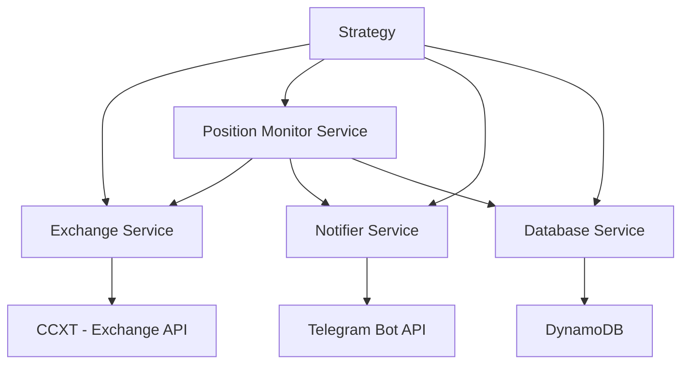

# Architecture Overview

## System Architecture

## Components

### Core Layer
- **constants.py**: Centralized configuration constants
- **exceptions.py**: Custom exception classes
- **utils.py**: Utility functions
- **models.py**: Data models
- **parameters.py**: Strategy and trading parameters

### Service Layer
- **Exchange Service**: Handles all exchange API interactions
- **Position Monitor**: Tracks position lifecycle (opening/closing)
- **Notifier Service**: Sends notifications (Telegram)
- **Database Service**: Persists trading data (DynamoDB)

### Strategy Layer
- **Base Strategy**: Abstract base class for all strategies
- **Listing Backrun**: Monitors new listings and executes trades

## Data Flow

1. Strategy monitors exchange for new listings
2. Signal generated → Order placed via Exchange Service
3. Position Monitor tracks opening → Notifies via Notifier
4. Position Monitor tracks closing → Saves to Database → Notifies

## Design Principles

- **Separation of Concerns**: Each service has single responsibility
- **Dependency Injection**: Services injected via Pydantic
- **Type Safety**: Full type hints with Pydantic validation
- **Configuration as Code**: YAML configs with validation
